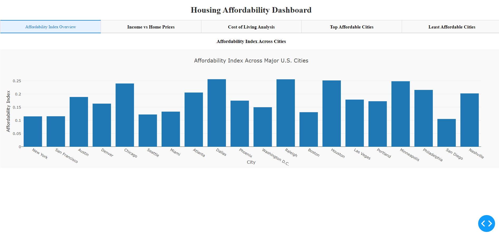
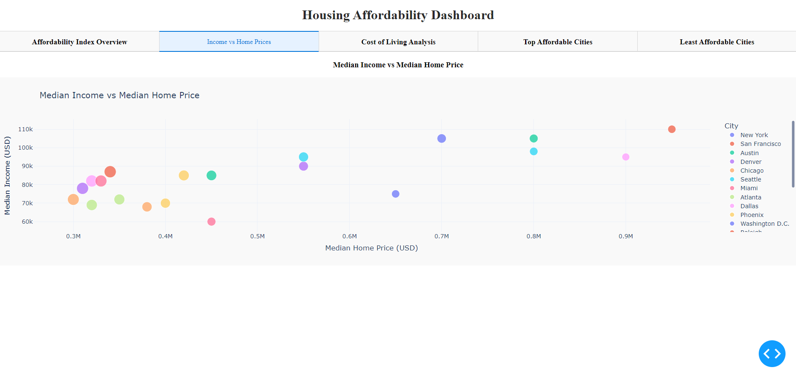
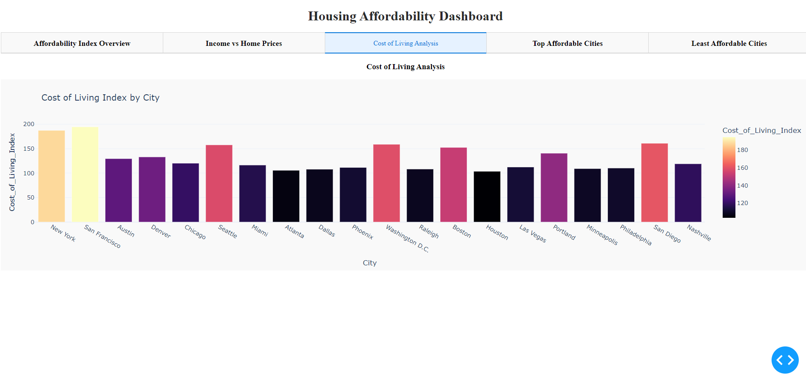
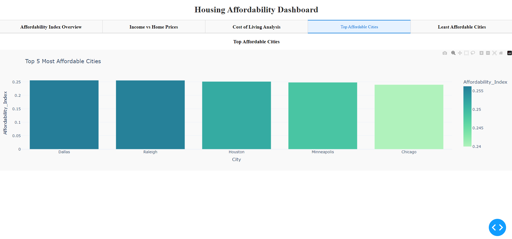
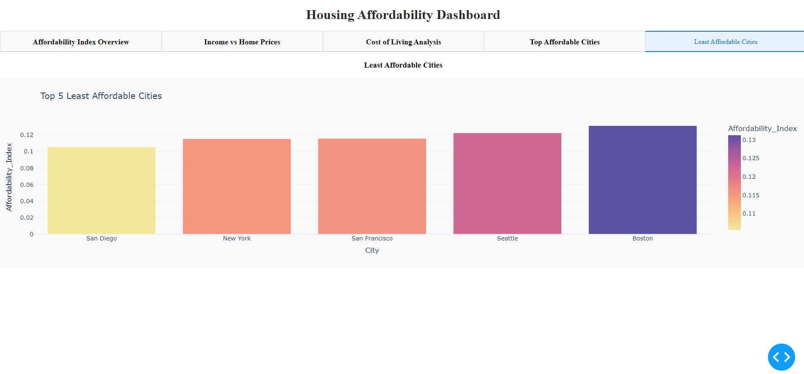

# Housing Affordability Dashboard README

## Overview
This project presents a comprehensive dashboard to analyze housing affordability across major U.S. cities. Using data on median home prices, household incomes, and cost of living indices, we calculate an Affordability Index for each city. The dashboard, built with Dash, provides multiple interactive visualizations to help users easily compare affordability between cities and identify trends.

## Technical Skills Demonstrated
- **Python Programming**: Proficient use of Python to develop a complete data dashboard.
- **Data Manipulation**: Using Pandas to clean, transform, and analyze the dataset.
- **Data Visualization**: Creating interactive plots with Plotly and adding interactive components with Dash.
- **Dashboard Development**: Building a fully functional and visually appealing web dashboard.

## Libraries Used
- **Pandas**: For data manipulation and analysis.
- **Plotly**: For creating interactive and visually appealing charts.
- **Dash**: For building the interactive web application.

## Dataset
The dataset used in this analysis contains the following columns:
- **City**: Name of the city.
- **Median_Home_Price**: The median price of a home in USD.
- **Median_Income**: The median household income in USD.
- **Cost_of_Living_Index**: A numerical representation of the cost of living in each city.

### Data Transformation
We calculate the **Affordability Index** as the ratio of median household income to median home price. A higher index indicates that homes are more affordable relative to the income level in that city.

## Dashboard Overview
The dashboard consists of five different panels:

### 1. Affordability Index Overview

- **Description**: A bar plot showcasing the affordability index across major U.S. cities. This visualization provides an at-a-glance comparison of how affordable housing is in each city.
- **Insights**: The higher the affordability index, the more affordable housing is relative to income.

### 2. Median Income vs Median Home Price

- **Description**: A scatter plot showing the relationship between median home prices and median income in each city. City points are colored to differentiate them and scaled based on their affordability index.
- **Insights**: This visualization helps identify cities that may have high home prices relative to income or vice versa.

### 3. Cost of Living Analysis

- **Description**: A bar plot displaying the cost of living index for each city. A higher cost of living index indicates that living in that city is more expensive.
- **Insights**: This helps compare cities based on the general cost of living, which includes housing, utilities, and other day-to-day expenses.

### 4. Top Affordable Cities

- **Description**: A bar plot showing the top 5 cities with the highest affordability index.
- **Insights**: Cities with a high affordability index offer better housing affordability relative to income levels. This plot helps identify the most affordable cities at a glance.

### 5. Least Affordable Cities

- **Description**: A bar plot showing the top 5 cities with the lowest affordability index.
- **Insights**: These cities have higher home prices relative to the income level, making them less affordable for an average household.

## How to Run the Project
1. Ensure Python and the required libraries are installed. You will need Pandas, Plotly, and Dash.
2. Clone the repository or download the project files.
3. Save the dataset as `housing_affordability.csv` in the project directory.
4. Run the script: `python housing_affordability.py`
5. Open your browser and navigate to `http://127.0.0.1:8050/` to view the dashboard.

## Future Improvements
- Add trend analysis over multiple years to see how affordability changes over time.
- Integrate more datasets, such as unemployment rates, to identify other factors influencing housing affordability.
- Provide predictive analytics to estimate how affordability might change in the future based on current trends.

## Acknowledgments
- **Data Sources**: The dataset used for this analysis was compiled from public data sources on median home prices, incomes, and cost of living indices.
- **Libraries**: Thanks to the open-source community for developing Pandas, Plotly, and Dash, which made this project possible.
